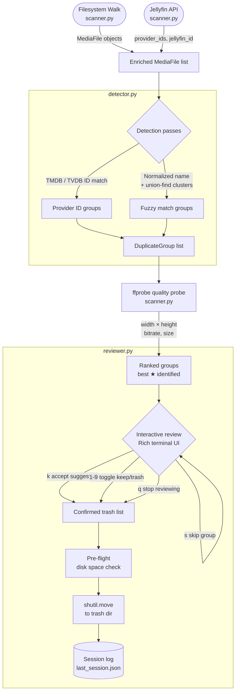

# jellyfin-deduper

Find and safely remove duplicate media files from your Jellyfin library. Matches duplicates using Jellyfin's TMDB/TVDB provider IDs for precision, falls back to fuzzy filename matching, ranks copies by quality (resolution → bitrate → size), and moves the lower-quality copies to a trash folder — nothing is permanently deleted.

## Features

- **Provider ID matching** — uses TMDB/TVDB IDs from the Jellyfin API; no false positives between different films with similar names
- **Fuzzy filename matching** — catches duplicates not yet in Jellyfin, strips quality/release tokens before comparing
- **Quality ranking** — picks the best copy via ffprobe (resolution × bitrate × size); degrades gracefully to file size if ffprobe is unavailable
- **Safe by default** — files are moved to a configurable trash folder, never deleted; full path structure preserved for easy recovery
- **Interactive review** — Rich terminal UI lets you inspect each group and override suggestions before anything moves
- **Dry-run mode** — simulate the entire process without touching any files
- **Cross-platform** — works on macOS, Linux, and Windows; no platform-specific dependencies

## Architecture



### Module responsibilities

| Module | Responsibility |
|--------|---------------|
| `jfdups.py` | CLI, config loading, phase orchestration |
| `scanner.py` | Filesystem walk, Jellyfin API pagination, ffprobe quality probing |
| `detector.py` | Provider ID grouping, fuzzy name matching, union-find clustering |
| `reviewer.py` | Rich interactive UI, trash move logic, session log |

## Requirements

- Python 3.9+
- [ffmpeg](https://ffmpeg.org/download.html) (optional, for quality-based ranking — falls back to file size without it)

Install Python dependencies:

```bash
pip install rich tomli
```

Install ffmpeg for quality ranking (optional):

```bash
# macOS
brew install ffmpeg

# Linux (Debian/Ubuntu)
apt install ffmpeg

# Windows
winget install ffmpeg
```

## Setup

Copy the example config and edit it:

```bash
cp jfdups.toml.example jfdups.toml
```

Set your Jellyfin API key. Either in `jfdups.toml`:

```toml
[jellyfin]
url     = "http://localhost:8096"
api_key = "your-api-key-here"
```

Or via environment variable (recommended — keeps the key out of config files):

```bash
export JFDUPS_API_KEY="your-api-key-here"
```

Get an API key from **Jellyfin Dashboard → Advanced → API Keys → +**.

Configure your media paths and trash directory in `jfdups.toml`:

```toml
[media]
paths = [
    "/path/to/media/Movies",
    "/path/to/media/TV",
]

[trash]
# Plain folder (all platforms)
dir = "/path/to/media/trash"

# macOS — integrates with Finder Trash (replace UID with output of `id -u`)
# dir = "/Volumes/YourDrive/.Trashes/501"

# Linux — FreeDesktop Trash spec
# dir = "/path/to/drive/.Trash-1000"
```

## Usage

```
python3 jfdups.py [--config PATH] [--dry-run] [--no-api] [--threshold FLOAT] [-y]
                  [scan | list | config]
```

**Commands:**

| Command | Description |
|---------|-------------|
| `scan` | Scan, detect, and interactively review duplicates *(default)* |
| `list` | Print all duplicate groups and exit — no moves |
| `config` | Print the resolved configuration and exit |

**Flags:**

| Flag | Description |
|------|-------------|
| `--dry-run` | Simulate everything; no files are moved |
| `--no-api` | Skip Jellyfin API; use filesystem + fuzzy matching only |
| `--threshold 0.9` | Override fuzzy similarity threshold (0.0–1.0, default 0.85) |
| `-y` | Auto-accept best suggestion for every group (non-interactive) |

**Examples:**

```bash
# Verify config
python3 jfdups.py config

# Preview what would be found and moved (safe)
python3 jfdups.py --dry-run scan

# List duplicates without reviewing
python3 jfdups.py list

# Full interactive run
python3 jfdups.py scan

# Non-interactive: accept best copy automatically
python3 jfdups.py -y scan
```

## Interactive review controls

When reviewing a duplicate group:

| Key | Action |
|-----|--------|
| `k` | Accept suggestion (keep best ★, trash the rest) |
| `1`–`9` | Toggle keep/trash for that file |
| `r` | Reverse all choices |
| `a` | Keep all files in this group (skip trashing) |
| `s` | Skip this group entirely |
| `q` | Stop reviewing; proceed to summary with decisions made so far |
| `Enter` | Same as `k` |

All moves happen in a single batch **after** you confirm the final summary — nothing is touched during the review loop.

## How duplicates are detected

**Pass 1 — Jellyfin provider IDs**
Files sharing the same TMDB or TVDB ID are exact duplicates regardless of filename. This is the most reliable signal and is checked first.

**Pass 2 — Fuzzy filename matching**
For files not matched by provider ID, filenames are normalized (lowercase, strip quality tokens like `1080p`/`BluRay`/`x265`, strip year) then compared with `difflib.SequenceMatcher`. Files are bucketed by their first two words to avoid O(n²) comparisons across large libraries. TV episodes must share the same SxEx code to be considered duplicates.

**Quality ranking**
Within each duplicate group, the best copy is selected by `(width × height, bitrate, file_size)` descending. Requires ffprobe; falls back to file size if unavailable.

## Recovery

Moved files are never deleted. To restore a file, find it under the trash directory (the full original path is preserved) and move it back.

Each session is logged to `~/.config/jfdups/last_session.json` with source and destination paths for every move.

## License

MIT — see [LICENSE](LICENSE).
